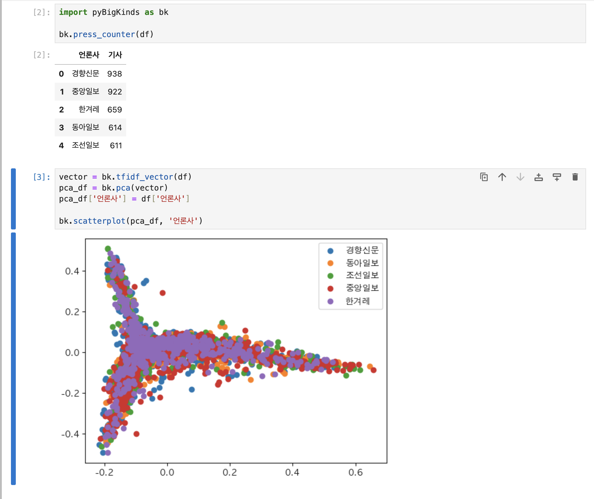
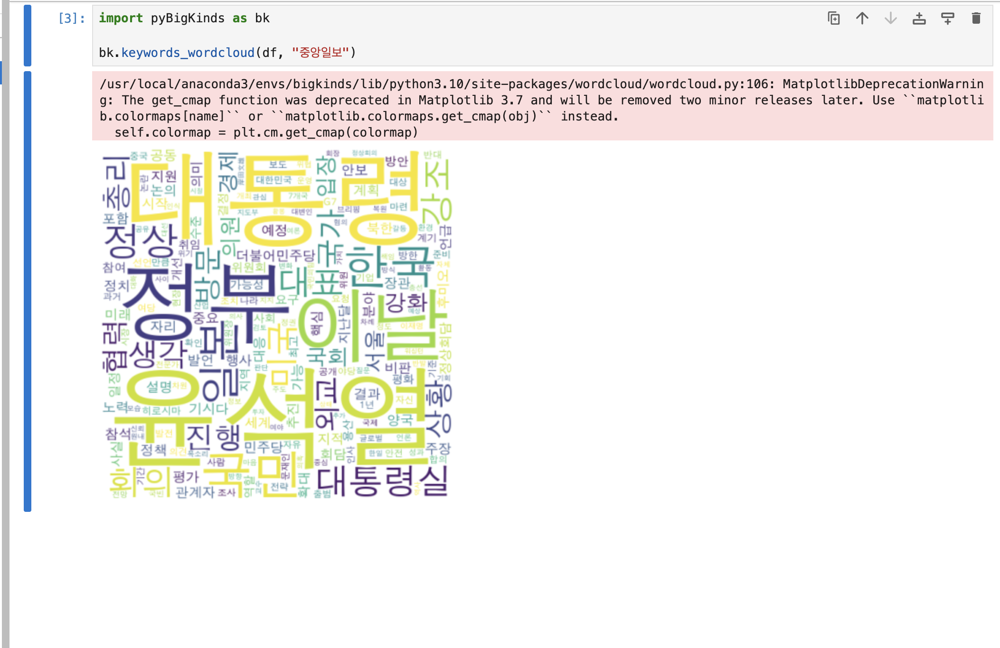

# pyBigKinds

pyBigKinds는 한국 언론의 빅데이터 저장소인 BigKinds에서 추출한 데이터를 low-Code로 분석할 수 있게 만든 툴입니다.

## Requirements

- Python >= 3.8

## Installation

- macOS

  ```bash
  python3 -m pip install pyBigKinds
  ```

- Windows, linux

  ```bash
  python -m pip install pyBigKinds
  ```

## Usage





## License

[MIT](https://choosealicense.com/licenses/mit/)

## you have some issue?

사용 중 문제 발생 시, 해당 Repo issue에 등록해주세요.
